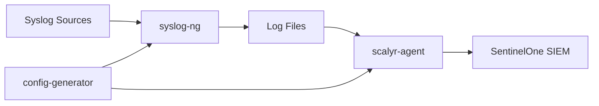

<!-- shows only on the light theme -->


<!-- shows only on the dark theme -->


# SentinelOne Syslog Collector

[](https://www.docker.com/)
[](https://www.sentinelone.com/)
[](LICENSE)
[](https://tools.ietf.org/html/rfc5424)

A production-ready Docker-based syslog collector that receives syslog messages and forwards them to SentinelOne SIEM in real-time using the [addEvents API](https://community.sentinelone.com/s/article/000006773).

> [!IMPORTANT]
> This collector uses SentinelOne's addEvents API to ingest syslog data directly into your SIEM for real-time threat detection and analysis.

## 🎯 Use Cases & When to Use This Project

**Need to differentiate multiple syslog sources on the same incoming port?** That's this project! 🎉

This is a fork of the [original SentinelOne Collector](https://community.sentinelone.com/s/article/000008665) designed to be easier, faster to deploy, and more scalable.

### Choose Your Collector:

- **Single syslog source or unique port per source?** → Use the [vanilla S1 Collector](https://community.sentinelone.com/s/topic/0TO69000000as2qGAA/sentinelone-collector) (no syslog-ng, straight Linux/Docker)
- **Multiple sources on same port with log differentiation?** → **Use this project!** 🚀
- **Want to test addEvents API before installing anything?** → Try the [addEvents testing project](https://github.com/sva-s1/addEvents)
- **Need raw log samples for testing and security research?** → Check out the [Log Zoo](https://github.com/sva-s1/log-zoo)!

> [!TIP]
> ⭐ **STAR this repo** if you find it useful!

## 📋 Prerequisites

> [!WARNING]
> Do not install Docker from your distribution repository as they can be outdated.

- **Docker Engine** - [Install Docker Engine](https://docs.docker.com/engine/install/)
- **Docker Compose** - [Install Docker Compose](https://docs.docker.com/compose/)
- **SentinelOne SIEM** with API access

## 🚀 Quick Setup (3 Steps)

### Step 1: Clone Repository
```bash
git clone https://github.com/sva-s1/syslog-collector
cd syslog-collector
```

### Step 2: Configure Environment

Copy example configuration
```bash
cp .env.example .env
```

Edit configuration with your SentinelOne details using your preferred editor
```bash
vim .env 
```

> [!NOTE]
> **Get your API key from SentinelOne Console:**
> SOC view → Policy & Settings → Singularity AI SIEM column → API Keys → Log Access Keys tab

**Required `.env` configuration:**
```bash
# SentinelOne API Configuration
AISIEM_LOGACCESS_WRITE_TOKEN=your-api-token-here  # From S1 console
AISIEM_SERVER=xdr.us1.sentinelone.net            # Your S1 server
SYSLOG_HOST=your-host-identifier                 # Unique identifier
```

### Step 3: Generate SSL Certificates

> [!TIP]
> Choose one option: self-signed certificates (quick) or import your own CA certificates (production)

**Option A: Generate self-signed certificates (recommended for testing)**
```bash
openssl req -x509 -nodes -newkey rsa:4096 -keyout syslog.key -out syslog.crt -subj '/CN=localhost' -days 3650
```

**Option B: Import your own CA certificates**
```bash
# Copy your certificates to the project directory
cp /path/to/your/certificate.crt syslog.crt
cp /path/to/your/private.key syslog.key
chmod 600 syslog.key
```

## 🏃 Execution

Once setup is complete, it's as easy as 1-2-3:

```bash
# Start the collector
docker compose up -d

# Send test messages
bash test-syslog.sh

# Check container status
docker compose ps
```

> [!TIP]
> Your syslog collector is now running and forwarding messages to SentinelOne SIEM!

## 🧪 Testing & Validation

### Send Test Messages
```bash
# Use the provided test script
bash test-syslog.sh
```

### Search for Test Messages in SentinelOne
1. Navigate to **Event Search**
2. Set filter to **ALL**
3. Search: `parser contains 'cisco'`
4. Verify your test messages appear

## 📊 Configuration Options

The `.env` file supports comprehensive configuration:

```bash
# Port Configuration
PORT1_PROTOCOL=udp          # Protocol: udp/tcp/tls
PORT1_NUMBER=514            # Port number
PORT1_TYPE=rfc5424          # Syslog format: rfc5424/rfc3164

PORT2_PROTOCOL=tls          # Encrypted syslog
PORT2_NUMBER=6514
PORT2_TYPE=rfc3164

# Source Type Configuration
SOURCE1_NAME=cisco-router   # Source identifier
SOURCE1_PARSER=ciscoRouter  # SentinelOne parser
SOURCE1_ATTRIBUTE=hostname  # Matching attribute
SOURCE1_MATCHER=router*     # Pattern to match
```

## 🏗️ Architecture



**Components:**
- **config-generator**: Processes `.env` and generates configurations
- **syslog-ng**: Receives and processes syslog messages
- **scalyr-agent**: Forwards logs to SentinelOne via addEvents API

## 🔧 Troubleshooting

### Check Container Health
```bash
# View container status
docker compose ps

# Check logs for errors
docker compose logs --follow
```

### Common Issues

> [!CAUTION]
> **API Authentication Failures**
> - Verify your `AISIEM_LOGACCESS_WRITE_TOKEN` is correct
> - Check token permissions in SentinelOne console
> - Ensure `AISIEM_SERVER` matches your regional tenant ingest URL (e.g., `xdr.us1.sentinelone.net`)
> - Check [SentinelOne Tenant Regions](https://community.sentinelone.com/s/article/000004961) for other regions

> [!CAUTION]
> **Certificate Issues**
> - Verify `syslog.crt` and `syslog.key` exist
> - Check certificate permissions: `ls -la syslog.*`
> - Regenerate if needed: `openssl req -x509 -nodes...`

### Debug Commands
```bash
# Test SentinelOne connectivity
docker compose exec scalyr-agent curl -v https://your-server.sentinelone.net

# Check generated configurations
docker compose exec config-generator cat /out/etc/scalyr-agent-2/agent.json

# Monitor log processing
docker compose exec syslog-ng ls -la /var/log/syslog-collector/
```

## 📚 Documentation & Support

- **Official SentinelOne Syslog Documentation**: [Community Article 000008665](https://community.sentinelone.com/s/article/000008665)
- **addEvents API Reference**: [Community Article 000006773](https://community.sentinelone.com/s/article/000006773)
- **Docker Documentation**: [docs.docker.com](https://docs.docker.com/)
- **Syslog RFC5424**: [tools.ietf.org/html/rfc5424](https://tools.ietf.org/html/rfc5424)

## 🔒 Security Features

- ✅ Secure environment variable substitution
- ✅ Encrypted TLS syslog reception (port 6514)
- ✅ API tokens never stored in plain text
- ✅ Temporary file cleanup with proper permissions
- ✅ Container isolation and minimal attack surface

## 📁 Project Structure

```
syslog-collector/
├── .env.example          # Configuration template
├── .env                  # Your configuration (create from example)
├── syslog.yaml          # Syslog configuration template
├── docker-compose.yml   # Container orchestration
├── substitute-and-run.sh # Configuration processor
├── test-syslog.sh       # Test message script
├── syslog.crt           # SSL certificate (generate/import)
├── syslog.key           # SSL private key (generate/import)
└── README.md            # This file
```

---

> [!TIP]
> **Need help?** Check the troubleshooting section above, review container logs, and verify your `.env` configuration matches the examples.
