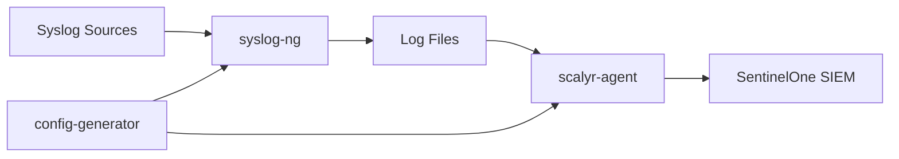

<svg xmlns="http://www.w3.org/2000/svg"
     viewBox="0 0 567.24 95.88"
     role="img" aria-label="SentinelOne logo">
  <!-- purple shield -->
  <rect x="32.08" width="12.92" height="77.25" fill="#6b0aea"/>
  <path d="M48.13,95.88l12.91-8V21a32.21,32.21,0,0,0-12.91-5.72Z" fill="#6b0aea"/>
  <path d="M16,87.92l12.92,8V15.32A32.19,32.19,0,0,0,16,21Z" fill="#6b0aea"/>
  <path d="M64.17,3.67V86.48l6-3.72a15.3,15.3,0,0,0,6.89-13V30.65C77.09,19.37,64.17,3.67,64.17,3.67Z" fill="#6b0aea"/>
  <path d="M0,69.73a15.27,15.27,0,0,0,6.89,13l6,3.72V3.67S0,19.37,0,30.65Z" fill="#6b0aea"/>

  <!-- word‑mark (everything below inherits the page’s text colour) -->
  <path d="M386.68,78.16V17.24L396,13.32V78.16Z" fill="currentColor"/>
  <path d="M372,52.64a11.52,11.52,0,0,0-3.69-8.79,12.59,12.59,0,0,0-8.77-3.28,12.16,12.16,0,0,0-8.65,3.28,13.24,13.24,0,0,0-4,8.79ZM359.36,78.89q-9.83,0-16-6.32T337.23,55.8q0-10.44,6.23-16.73t16.11-6.27q9.89,0,16,6t6.15,15.76a27.23,27.23,0,0,1-.33,4.37h-34.6a12.7,12.7,0,0,0,3.81,8.87,12.25,12.25,0,0,0,8.73,3.28q7.63,0,10.74-6.24h10.09A20,20,0,0,1,372.73,75,22.14,22.14,0,0,1,359.36,78.89Z" fill="currentColor"/>
  <path d="M300.73,33.53v7q4.5-7.77,14.43-7.77a16.93,16.93,0,0,1,12.58,5q5,5,5,14V78.16h-9.26V53.21q0-6-3-9.19a10.83,10.83,0,0,0-8.28-3.2A11,11,0,0,0,303.8,44q-3.07,3.19-3.07,9.19V78.16h-9.35V33.53Z" fill="currentColor"/>
  <path d="M274,78.16V33.53h9.35V78.16Zm-6.77-37.1h-11v24.7a4.72,4.72,0,0,0,1.19,3.61c.79.73,2.14,1.09,4.06,1.09h5.74v7.7h-7.38q-13,0-13-12.4V26.34l9.43-3.91v11.1h11Z" fill="currentColor"/>
  <path d="M213.27,28.67v7Q215,32.8,225,32.8a17,17,0,0,1,12.59,5q5,5,5,14V78.16h-9.27V53.21q0-6-3-9.19a10.83,10.83,0,0,0-8.28-3.2A11,11,0,0,0,213.6,44q-3.07,3.19-3.08,9.19V78.16h-9.34V33.53Z" fill="currentColor"/>
  <path d="M187.86,52.64a11.52,11.52,0,0,0-3.69-8.79A12.59,12.59,0,0,0,174,40.57a12.16,12.16,0,0,0-8.65,3.28,13.19,13.19,0,0,0-4,8.79ZM173.86,78.89q-9.84,0-16-6.32T151.72,55.8q0-10.44,6.23-16.73t16.11-6.27q9.88,0,16,6t6.15,15.76a27.23,27.23,0,0,1-.33,4.37h-34.6a12.66,12.66,0,0,0,3.82,8.87,12.21,12.21,0,0,0,8.73,3.28q7.62,0,10.74-6.24h10.08A20,20,0,0,1,187.22,75,22.13,22.13,0,0,1,173.86,78.89Z" fill="currentColor"/>
  <path d="M127.27,28.67a10.54,10.54,0,0,0-6.8,2.1,7.39,7.39,0,0,0-2.63,6.12A6.91,6.91,0,0,0,121,43a21.56,21.56,0,0,0,7.54,3.08q4.42,1,8.85,2.23A15.94,15.94,0,0,1,144.9,53q3.1,3.39,3.11,9.64t-5.33,11.17q-5.33,4.95-14.26,5t-14.51-4.14a13.41,13.41,0,0,1-5.58-11.42h10a8.6,8.6,0,0,0,2.79,5.92q2.46,2.18,7.22,2.18a10.91,10.91,0,0,0,7.5-2.43,8,8,0,0,0,1.06-10.93,10.27,10.27,0,0,0-4.34-2.8,56,56,0,0,0-5.86-1.66q-3.2-.72-6.44-1.7a27.57,27.57,0,0,1-5.9-2.51,11.71,11.71,0,0,1-4.35-4.5,14.44,14.44,0,0,1-1.68-7.24,14.72,14.72,0,0,1,5.37-11.87q5.37-4.5,13.94-4.5T141.33,25q5.13,3.89,5.7,11.26H136.7a8.14,8.14,0,0,0-2.79-5.43A9.61,9.61,0,0,0,127.27,28.67Z" fill="currentColor"/>
  <path d="M532.86,36.07a19.44,19.44,0,0,0-8.84,2,15.82,15.82,0,0,0-6.51,6.1,19.76,19.76,0,0,0-2.58,10.12H550a18.2,18.2,0,0,0-2.05-10.16,14.78,14.78,0,0,0-6.39-6.1A19.46,19.46,0,0,0,532.86,36.07Zm-.16,38.71A18.65,18.65,0,0,0,544,71.44a13.63,13.63,0,0,0,5.57-9.11h3.85a17.64,17.64,0,0,1-6.68,11.24q-5.44,4.26-13.88,4.26a22.74,22.74,0,0,1-11.17-2.69A19.25,19.25,0,0,1,514,67.39a24.4,24.4,0,0,1-2.78-12A24.2,24.2,0,0,1,514,43.54a19.31,19.31,0,0,1,7.66-7.75,22.74,22.74,0,0,1,11.17-2.69A22.19,22.19,0,0,1,544,35.79a18.26,18.26,0,0,1,7.12,7.07,19.05,19.05,0,0,1,2.42,9.35,24.11,24.11,0,0,1-.41,4.26H514.93a20.14,20.14,0,0,0,2.58,10.24,15.58,15.58,0,0,0,6.47,6.1A19.39,19.39,0,0,0,532.7,74.78Z" fill="currentColor"/>
  <path d="M487.15,32.78a18.56,18.56,0,0,1,14.3,6.88q4.91,4.82,4.91,14.21V77.27h-3.68V52c0-5.24-1.34-9.25-4-12s-6.33-4.14-11-4.14a15.24,15.24,0,0,0-11.59,4.62q-4.38,4.62-4.38,13.61V77.27h-3.68V33.66h3.68V45.15a15.57,15.57,0,0,1,6.27-9.24A18.6,18.6,0,0,1,487.15,32.78Z" fill="currentColor"/>
  <path d="M431.7,24.44a24.09,24.09,0,0,0-12.24,3.14,22.31,22.31,0,0,0-8.6,8.91A27.75,27.75,0,0,0,407.71,50a27.75,27.75,0,0,0,3.15,13.49,22.37,22.37,0,0,0,8.6,8.91,25.42,25.42,0,0,0,24.44,0,22.27,22.27,0,0,0,8.64-8.91A27.75,27.75,0,0,0,455.69,50a27.75,27.75,0,0,0-3.15-13.49,22.2,22.2,0,0,0-8.64-8.91A24.15,24.15,0,0,0,431.7,24.44Zm0-3.29A28.09,28.09,0,0,1,446,24.81,25.62,25.62,0,0,1,455.9,35,31,31,0,0,1,459.46,50a31,31,0,0,1-3.56,14.94A26,26,0,0,1,446,75.19a29.45,29.45,0,0,1-28.58,0,26.21,26.21,0,0,1-10-10.27A30.63,30.63,0,0,1,403.86,50,30.63,30.63,0,0,1,407.46,35a25.85,25.85,0,0,1,10-10.23A28.07,28.07,0,0,1,431.7,21.15Z" fill="currentColor"/>
  <path d="M563.47,39.55l-1-1.51h-.82v1.51h-1V34.82h2.16c1.12,0,1.79.59,1.79,1.56v0a1.47,1.47,0,0,1-1,1.46l1.16,1.69Zm0-3.11c0-.45-.31-.68-.82-.68h-1v1.36h1.05c.51,0,.8-.27.8-.67Z" fill="currentColor"/>
  <circle cx="562.4" cy="37.32" r="4.85" fill="none" stroke="currentColor" stroke-width="1"/>
</svg>

# SentinelOne Syslog Collector

[](https://www.docker.com/)
[](https://www.sentinelone.com/)
[](LICENSE)
[](https://tools.ietf.org/html/rfc5424)

A production-ready Docker-based syslog collector that receives syslog messages and forwards them to SentinelOne SIEM in real-time using the [addEvents API](https://community.sentinelone.com/s/article/000006773).

> [!IMPORTANT]
> This collector uses SentinelOne's addEvents API to ingest syslog data directly into your SIEM for real-time threat detection and analysis.

## 🎯 Use Cases & When to Use This Project

**Need to differentiate multiple syslog sources on the same incoming port?** That's this project! 🎉

This is a fork of the [original SentinelOne Collector](https://community.sentinelone.com/s/article/000008665) designed to be easier, faster to deploy, and more scalable.

### Choose Your Collector:

- **Single syslog source or unique port per source?** → Use the [vanilla S1 Collector](https://community.sentinelone.com/s/topic/0TO69000000as2qGAA/sentinelone-collector) (no syslog-ng, straight Linux/Docker)
- **Multiple sources on same port with log differentiation?** → **Use this project!** 🚀
- **Want to test addEvents API before installing anything?** → Try the [addEvents testing project](https://github.com/sva-s1/addEvents)
- **Need raw log samples for testing and security research?** → Check out the [Log Zoo](https://github.com/sva-s1/log-zoo)!

> [!TIP]
> ⭐ **STAR this repo** if you find it useful!

## 📋 Prerequisites

> [!WARNING]
> Do not install Docker from your distribution repository as they can be outdated.

- **Docker Engine** - [Install Docker Engine](https://docs.docker.com/engine/install/)
- **Docker Compose** - [Install Docker Compose](https://docs.docker.com/compose/)
- **SentinelOne SIEM** with API access

## 🚀 Quick Setup (3 Steps)

### Step 1: Clone Repository
```bash
git clone https://github.com/sva-s1/syslog-collector
cd syslog-collector
```

### Step 2: Configure Environment
```bash
# Copy example configuration
cp .env.example .env

# Edit configuration with your SentinelOne details
vim .env  # or nano .env

# Secure the configuration file
chmod 400 .env
```

> [!NOTE]
> **Get your API key from SentinelOne Console:**
> SOC view → Policy & Settings → Singularity AI SIEM column → API Keys → Log Access Keys tab

**Required `.env` configuration:**
```bash
# SentinelOne API Configuration
AISIEM_LOGACCESS_WRITE_TOKEN=your-api-token-here  # From S1 console
AISIEM_SERVER=xdr.us1.sentinelone.net            # Your S1 server
SYSLOG_HOST=your-host-identifier                 # Unique identifier
```

### Step 3: Generate SSL Certificates

> [!TIP]
> Choose one option: self-signed certificates (quick) or import your own CA certificates (production)

**Option A: Generate self-signed certificates (recommended for testing)**
```bash
openssl req -x509 -nodes -newkey rsa:4096 -keyout syslog.key -out syslog.crt -subj '/CN=localhost' -days 3650
```

**Option B: Import your own CA certificates**
```bash
# Copy your certificates to the project directory
cp /path/to/your/certificate.crt syslog.crt
cp /path/to/your/private.key syslog.key
chmod 600 syslog.key
```

## 🏃 Execution

Once setup is complete, it's as easy as 1-2-3:

```bash
# Start the collector
docker compose up -d

# Send test messages
bash test-syslog.sh

# Check container status
docker compose ps
```

> [!TIP]
> Your syslog collector is now running and forwarding messages to SentinelOne SIEM!

## 🧪 Testing & Validation

### Send Test Messages
```bash
# Use the provided test script
bash test-syslog.sh
```

### Search for Test Messages in SentinelOne
1. Navigate to **Event Search**
2. Set filter to **ALL**
3. Search: `parser contains 'cisco'`
4. Verify your test messages appear

## 📊 Configuration Options

The `.env` file supports comprehensive configuration:

```bash
# Port Configuration
PORT1_PROTOCOL=udp          # Protocol: udp/tcp/tls
PORT1_NUMBER=514            # Port number
PORT1_TYPE=rfc5424          # Syslog format: rfc5424/rfc3164

PORT2_PROTOCOL=tls          # Encrypted syslog
PORT2_NUMBER=6514
PORT2_TYPE=rfc3164

# Source Type Configuration
SOURCE1_NAME=cisco-router   # Source identifier
SOURCE1_PARSER=ciscoRouter  # SentinelOne parser
SOURCE1_ATTRIBUTE=hostname  # Matching attribute
SOURCE1_MATCHER=router*     # Pattern to match
```

## 🏗️ Architecture



**Components:**
- **config-generator**: Processes `.env` and generates configurations
- **syslog-ng**: Receives and processes syslog messages
- **scalyr-agent**: Forwards logs to SentinelOne via addEvents API

## 🔧 Troubleshooting

### Check Container Health
```bash
# View container status
docker compose ps

# Check logs for errors
docker compose logs --follow
```

### Common Issues

> [!CAUTION]
> **API Authentication Failures**
> - Verify your `AISIEM_LOGACCESS_WRITE_TOKEN` is correct
> - Check token permissions in SentinelOne console
> - Ensure `AISIEM_SERVER` matches your regional tenant ingest URL (e.g., `xdr.us1.sentinelone.net`)
> - Check [SentinelOne Tenant Regions](https://community.sentinelone.com/s/article/000004961) for other regions

> [!CAUTION]
> **Certificate Issues**
> - Verify `syslog.crt` and `syslog.key` exist
> - Check certificate permissions: `ls -la syslog.*`
> - Regenerate if needed: `openssl req -x509 -nodes...`

### Debug Commands
```bash
# Test SentinelOne connectivity
docker compose exec scalyr-agent curl -v https://your-server.sentinelone.net

# Check generated configurations
docker compose exec config-generator cat /out/etc/scalyr-agent-2/agent.json

# Monitor log processing
docker compose exec syslog-ng ls -la /var/log/syslog-collector/
```

## 📚 Documentation & Support

- **Official SentinelOne Syslog Documentation**: [Community Article 000008665](https://community.sentinelone.com/s/article/000008665)
- **addEvents API Reference**: [Community Article 000006773](https://community.sentinelone.com/s/article/000006773)
- **Docker Documentation**: [docs.docker.com](https://docs.docker.com/)
- **Syslog RFC5424**: [tools.ietf.org/html/rfc5424](https://tools.ietf.org/html/rfc5424)

## 🔒 Security Features

- ✅ Secure environment variable substitution
- ✅ Encrypted TLS syslog reception (port 6514)
- ✅ API tokens never stored in plain text
- ✅ Temporary file cleanup with proper permissions
- ✅ Container isolation and minimal attack surface

## 📁 Project Structure

```
syslog-collector/
├── .env.example          # Configuration template
├── .env                  # Your configuration (create from example)
├── syslog.yaml          # Syslog configuration template
├── docker-compose.yml   # Container orchestration
├── substitute-and-run.sh # Configuration processor
├── test-syslog.sh       # Test message script
├── syslog.crt           # SSL certificate (generate/import)
├── syslog.key           # SSL private key (generate/import)
└── README.md            # This file
```

---

> [!TIP]
> **Need help?** Check the troubleshooting section above, review container logs, and verify your `.env` configuration matches the examples.
